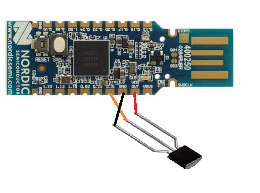

# nrf52-pca10059-zephyr

## Description

## Requirements

# Hardware

- nRF52-Dongle
- MCP9701-E/TO

## Build and Flash

```
cd %userprofile%\zephyrproject\zephyr\samples\bluetooth
git clone https://github.com/fprotopapa/nrf52-pca10059-zephyr.git

cd ..\..\..
west build -d nrf52dongle -p auto -b nrf52840dongle_nrf52840 zephyr/samples/bluetooth/nrf52-pca10059-zephyr
nrfutil pkg generate --hw-version 52 --sd-req=0x00 --application nrf52dongle/zephyr/zephyr.hex --application-version 1 nrf52dongle.zip
nrfutil dfu usb-serial -pkg nrf52dongle.zip -p COM<XX>
```

## Circuit

